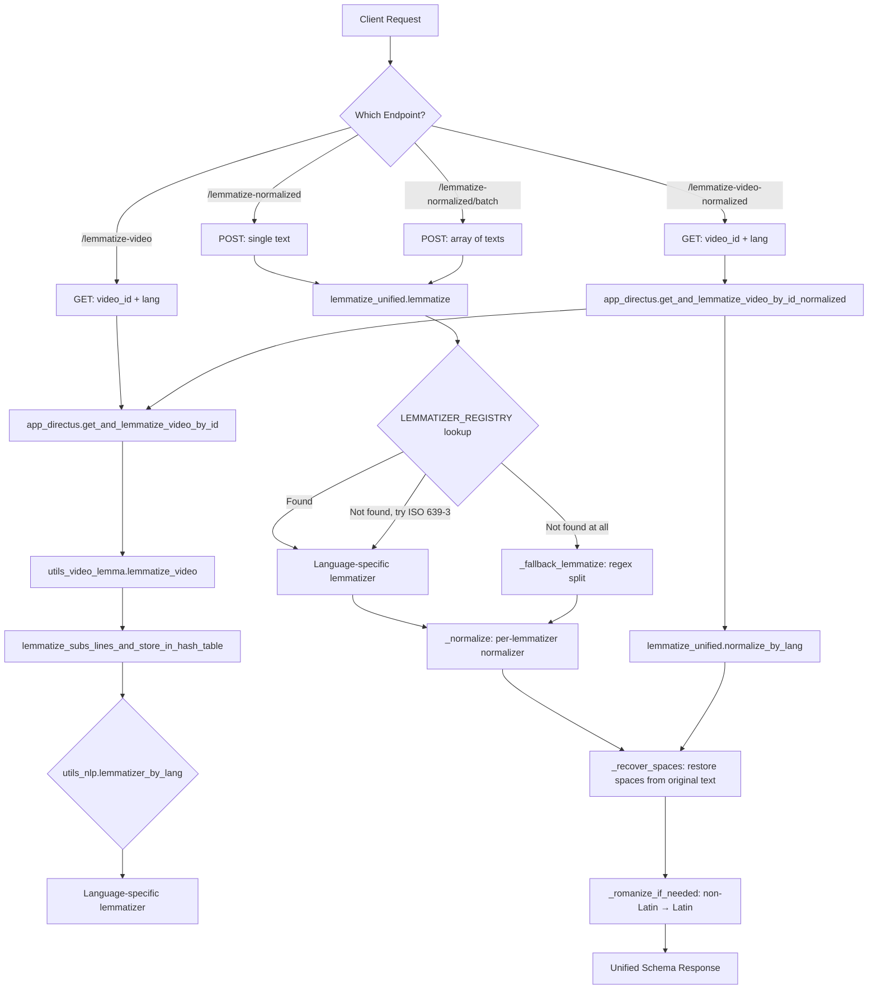

# ARCH-015 — Server-Side Tokenization Pipeline

> **Source files**: `zerotohero-python-server/lemmatize_*.py`, `routes/text_routes.py`, `utils_nlp.py`, `utils_cache.py`, `romanize.py`, `app_directus.py`
> **Last updated**: 2026-07-26

---

## Overview

The Python backend provides tokenization (lemmatization + pronunciation) for **all supported L2 languages** via a unified pipeline. Text enters through one of four API endpoints, is dispatched to the appropriate language-specific tokenizer, normalized into a consistent schema, and returned with optional romanization for non-Latin scripts.

This document covers the **server side only** — how the client consumes these endpoints is documented separately.

---

## Architecture Diagram



---

## API Endpoints

All endpoints are registered in `routes/text_routes.py` and served by the Flask app (`app.py`) at `http://127.0.0.1:5001`.

### 1. `POST /lemmatize-normalized` (Primary)

**Purpose**: Lemmatize a single text string for on-the-fly tokenization (subtitle lines, text passages).

**Request**:
```json
{ "text": "你好世界", "l2": "zh" }
```

**Response** (unified schema):
```json
{
  "tokens": [
    { "text": "你好", "lemmas": [{"lemma": "你好", "part_of_speech": "l"}], "pronunciation": "nǐ hǎo" },
    { "text": " ", "lemmas": [] },
    { "text": "世界", "lemmas": [{"lemma": "世界", "part_of_speech": "n"}], "pronunciation": "shì jiè" }
  ]
}
```

### 2. `POST /lemmatize-normalized/batch` (Batch)

**Purpose**: Lemmatize multiple texts in one request (e.g., reader blocks).

**Request**:
```json
{ "texts": ["Heading text", "Paragraph one.", "Paragraph two."], "l2": "zh" }
```

**Response**:
```json
{
  "results": [
    [{ "text": "Heading", "lemmas": [...], "pronunciation": null }, ...],
    [{ "text": "Paragraph", "lemmas": [...], "pronunciation": null }, ...],
    ...
  ]
}
```

Each `results[i]` corresponds to `texts[i]` — matched by array index.

### 3. `GET /lemmatize-video` (Legacy)

**Purpose**: Lemmatize all subtitle lines of a video. Uses disk cache (local + remote PHP cache).

**Request**: `GET /lemmatize-video?video_id=75&lang=zh`

**Response** (legacy — raw per-lemmatizer output):
```json
{
  "e4d909c290d0fb1ca068ffaddf22cbd0": "[{\"word\":\"The\",\"lemma\":\"the\",\"pos\":\"DET\"}, ...]",
  "fe8ce58...": "[{\"word\":\"Hello\",\"lemma\":\"hello\",\"pos\":\"INTJ\"}, ...]"
}
```

⚠️ **LEGACY**. Values may be JSON-stringified. No unified schema. No space recovery. Prefer `/lemmatize-video-normalized`.

### 4. `GET /lemmatize-video-normalized` (Preferred)

**Purpose**: Same as legacy but normalizes every line's tokens into the unified schema with space recovery.

**Response** (unified):
```json
{
  "e4d909c...": {
    "tokens": [
      { "text": "The", "lemmas": [{"lemma": "the", "part_of_speech": "DET"}], "pronunciation": null },
      { "text": " ", "lemmas": [] },
      ...
    ]
  }
}
```

---

## The Unified Pipeline — `lemmatize_unified.py`

Every `POST /lemmatize-normalized` request flows through `lemmatize_unified.lemmatize(text, l2)`. This is the core dispatch engine.

### Pipeline Steps

```
1. LANGUAGE LOOKUP
   ├── Direct match in LEMMATIZER_REGISTRY (ISO 639-1 or ISO 639-3)
   ├── Fallback: ISO 639-1 → ISO 639-3 via utils_language.iso_639_3_by_code()
   └── Fallback: _fallback_lemmatize() — regex word/punctuation split

2. LEMMATIZER DISPATCH
   ├── Language-specific lemmatizer is called with raw text
   ├── Returns lemmatizer-specific raw format (e.g., jieba: [{word, pos, pronunciation}])
   └── Lemmatizer output is cached on disk (MD5 hash) to avoid re-computation

3. NORMALIZATION
   ├── _normalize() dispatches to the correct per-lemmatizer normalizer
   ├── Converts raw format → unified schema:
   │   { "tokens": [{ "text": str, "lemmas": [{ "lemma": str, "part_of_speech": str }],
   │                  "pronunciation": str | null }] }
   └── _filter_empty() removes null/empty-text tokens

4. SPACE RECOVERY
   ├── _recover_spaces() walks the original text character by character
   ├── Finds each token in the original text
   ├── Inserts space/newline/tab gap tokens between word tokens
   └── Chinese/Japanese: no space tokens (text has no spaces)
       English/Korean: space tokens inserted at correct positions

5. ROMANIZATION (optional)
   ├── _romanize_if_needed() for non-Latin scripts
   ├── Korean: Hangul → Revised Romanization
   ├── Cyrillic: ru/bg/uk → Latin (ISO 9)
   ├── Greek: el → Latin (ISO 843)
   ├── Armenian: hy → Latin (ISO 9985)
   └── Georgian: ka → Latin (ISO 9984)

6. RESPONSE
   └── JSON with "tokens" key in unified schema
```

### The LEMMATIZER_REGISTRY

Maps language codes (ISO 639-1 and ISO 639-3) to `(module, function_name, needs_lang_param)` tuples:

| Language | Codes | Tokenizer Module | Engine | needs_lang |
|---|---|---|---|---|
| Chinese | `zh`, `zho`, `zh-Hans`, `zh-Hant` | `lemmatize_chinese` | jieba (POS) + pypinyin | No |
| Japanese | `ja`, `jpn` | `lemmatize_japanese` | MeCab (Tagger) | No |
| Korean | `ko`, `kor` | `lemmatize_korean` | Okt (konlpy) | No |
| Russian | `ru`, `rus` | `lemmatize_russian` | pymorphy2 | No |
| Arabic | `ar`, `ara` | `lemmatize_arabic` | Qalsadi + Mishkal | No |
| Persian | `fa`, `fas` | `lemmatize_persian` | Hazm + PersianG2p | No |
| Turkish | `tr`, `tur` | `lemmatize_turkish` | Zeyrek | No |
| Burmese | `my`, `mya` | `lemmatize_burmese` | pyidaungsu | No |
| Catalan | `ca` | `lemmatize_spacy` | spaCy (`ca_core_news_sm`) | Yes |
| Danish | `da` | `lemmatize_spacy` | spaCy (`da_core_news_sm`) | Yes |
| German | `de` | `lemmatize_spacy` | spaCy (`de_core_news_sm`) | Yes |
| Greek | `el` | `lemmatize_spacy` | spaCy (`el_core_news_sm`) | Yes |
| English | `en` | `lemmatize_spacy` | spaCy (`en_core_web_sm`) | Yes |
| Spanish | `es` | `lemmatize_spacy` | spaCy (`es_core_news_sm`) | Yes |
| Finnish | `fi` | `lemmatize_spacy` | spaCy (`fi_core_news_sm`) | Yes |
| French | `fr` | `lemmatize_spacy` | spaCy (`fr_core_news_sm`) | Yes |
| Croatian | `hr` | `lemmatize_spacy` | spaCy (`hr_core_news_sm`) | Yes |
| Italian | `it` | `lemmatize_spacy` | spaCy (`it_core_news_sm`) | Yes |
| Lithuanian | `lt` | `lemmatize_spacy` | spaCy (`lt_core_news_sm`) | Yes |
| Macedonian | `mk` | `lemmatize_spacy` | spaCy (`mk_core_news_sm`) | Yes |
| Norwegian Bokmål | `nb` | `lemmatize_spacy` | spaCy (`nb_core_news_sm`) | Yes |
| Dutch | `nl` | `lemmatize_spacy` | spaCy (`nl_core_news_sm`) | Yes |
| Polish | `pl` | `lemmatize_spacy` | spaCy (`pl_core_news_sm`) | Yes |
| Portuguese | `pt` | `lemmatize_spacy` | spaCy (`pt_core_news_sm`) | Yes |
| Romanian | `ro` | `lemmatize_spacy` | spaCy (`ro_core_news_sm`) | Yes |
| Swedish | `sv` | `lemmatize_spacy` | spaCy (`sv_core_news_sm`) | Yes |
| Ukrainian | `uk` | `lemmatize_spacy` | spaCy (`uk_core_news_sm`) | Yes |
| Asturian | `ast` | `lemmatize_simple` | Simplemma | Yes |
| Bulgarian | `bg` | `lemmatize_simple` | Simplemma | Yes |
| Czech | `cs` | `lemmatize_simple` | Simplemma | Yes |
| Estonian | `et` | `lemmatize_simple` | Simplemma | Yes |
| Irish | `ga` | `lemmatize_simple` | Simplemma | Yes |
| Galician | `gl` | `lemmatize_simple` | Simplemma | Yes |
| Manx | `gv` | `lemmatize_simple` | Simplemma | Yes |
| Hungarian | `hu` | `lemmatize_simple` | Simplemma | Yes |
| Armenian | `hy` | `lemmatize_simple` | Simplemma | Yes |
| Indonesian | `id` | `lemmatize_simple` | Simplemma | Yes |
| Icelandic | `is` | `lemmatize_simple` | Simplemma | Yes |
| Georgian | `ka` | `lemmatize_simple` | Simplemma | Yes |
| Latin | `la` | `lemmatize_simple` | Simplemma | Yes |
| Latvian | `lv` | `lemmatize_simple` | Simplemma | Yes |
| Malay | `ms` | `lemmatize_simple` | Simplemma | Yes |
| Norwegian Nynorsk | `nn` | `lemmatize_simple` | Simplemma | Yes |
| Slovak | `sk` | `lemmatize_simple` | Simplemma | Yes |
| Slovenian | `sl` | `lemmatize_simple` | Simplemma | Yes |
| Albanian | `sq` | `lemmatize_simple` | Simplemma | Yes |
| Swahili | `sw` | `lemmatize_simple` | Simplemma | Yes |
| Tagalog | `tl` | `lemmatize_simple` | Simplemma | Yes |

> **Note**: Vietnamese (`vi`/`vie`) has its own tokenizer module (`lemmatize_vietnamese.py` using pyvi) but is **not registered** in `LEMMATIZER_REGISTRY`. It is listed in the legacy `utils_nlp.tokenizers` dictionary but is not dispatched through the unified pipeline. Vietnamese falls through to `_fallback_lemmatize`.

### Additional Lemmatizers Not in Unified Pipeline

These exist in `utils_nlp.py`'s legacy `tokenizers` dictionary and are used by the legacy video lemmatization path:

| Tokenizer Module | Languages | Engine |
|---|---|---|
| `lemmatize_vietnamese` | `vie` | pyvi (ViTokenizer) |
| `lemmatize_lemmatization_lists` | 24 languages (see below) | Pre-computed CSV lookup tables |

**Lemmatization list languages** (static lookup tables at `data/lemmatization-lists/lemmatization-{code}.txt`):
`ast`, `bul`, `cat`, `ces`, `cym`, `deu`, `eng`, `est`, `fas`, `fra`, `gla`, `gle`, `glg`, `glv`, `hun`, `ita`, `por`, `ron`, `rus`, `slk`, `slv`, `spa`, `swe`, `ukr`

---

## Language-Specific Tokenizer Details

### Chinese — jieba + pypinyin (`lemmatize_chinese.py`)

**Engine**: [jieba](https://github.com/fxsjy/jieba) POS segmentation + [pypinyin](https://github.com/mozillazg/python-pinyin)

**Raw output format**:
```python
[{"word": "世界", "pos": "n", "pronunciation": "shì jiè"}, ...]
```

**How it works**:
1. `jieba.posseg.cut(text)` — segments text into words with POS tags
2. `pypinyin.pinyin(word, style=Style.TONE)` — generates tone-marked pinyin for each word
3. Pronunciation is space-joined pinyin: `"shì jiè"`
4. Cache key: `cache/lemmatization/jieba/zho/{md5}`

**POS tags**: Uses jieba's POS tagset (e.g., `n` = noun, `v` = verb, `a` = adjective, `l` = idiom, `x` = punctuation).

**Chinese is lemma-less**: For Chinese, the surface form IS the lemma. `lemma_from_word()` returns the word unchanged. There is no inflection to reduce.

---

### Japanese — MeCab (`lemmatize_japanese.py`)

**Engine**: [MeCab](https://taku910.github.io/mecab/) morphological analyzer

**Raw output format**:
```python
[{"word": "食べる", "lemma": "食べる", "pos": "動詞", "pronunciation": "タベル"}, ...]
```

**How it works**:
1. `MeCab.Tagger().parse(text)` — full morphological parse
2. Tab-separated output: `surface\tsurface_pronunciation\tlemma_pronunciation\tlemma\tpos\t...`
3. **Lemma cleanup**: If lemma contains `-代名詞` suffix (e.g. `私-代名詞`), strips after `-`
4. **Katakana-as-lemma fix**: If lemma is all-katakana but surface contains kanji (e.g., proper noun `葉子 → ヨウコ`), uses surface as lemma
5. Pronunciation is katakana (surface reading)
6. Cache key: `cache/lemmatization/mecab/jpn/{md5}`

**POS tags**: MeCab's native POS system (e.g., `動詞` = verb, `名詞` = noun, `助詞` = particle, `補助記号-*` = punctuation).

---

### Korean — Okt / Open Korean Text (`lemmatize_korean.py`)

**Engine**: [Okt](https://github.com/konlpy/konlpy) (Open Korean Text) from konlpy

**Requirements**: Java 17+ (Temurin), `JAVA_HOME` set to `/Library/Java/JavaVirtualMachines/temurin-17.jdk/Contents/Home`

**Raw output format**:
```python
[{"stem": "먹", "text": "먹어요", "pos": "Verb", "offset": 0, "length": 3, "unknown": False}, ...]
```

**How it works**:
1. `Okt.pos(text, norm=True)` — first pass: POS tagging with normalization
2. For each token: `Okt.pos(token, stem=True, norm=True)` — second pass: stem extraction
3. `stem` field contains the base form (e.g., `먹` from `먹어요`)
4. `text` field contains the surface form
5. Offsets are tracked for potential text reconstruction
6. Cache key: `cache/lemmatization/openkoreantext/kor/{md5}`

**POS tags**: Okt's tagset (e.g., `Noun`, `Verb`, `Adjective`, `Punctuation`, `Josa`, `Eomi`).

---

### Russian — pymorphy2 (`lemmatize_russian.py`)

**Engine**: [pymorphy2](https://github.com/pymorphy2/pymorphy2) morphological analyzer

**Raw output format**:
```python
[{"word": "хорошая", "lemmas": [
    {"lemma": "хороший", "pos": "ADJF", "morphologies": "sing, femn, nomn"}
]}, ...]
```

**How it works**:
1. `re.findall(r'\w+|[^\w\s]', text)` — word/punctuation tokenization
2. For each token: `pymorphy2.MorphAnalyzer().parse(token)` — morphological analysis
3. Multiple parses are possible — grouped by `(lemma, pos)` to deduplicate
4. Each parse includes inflection morphology (case, gender, number, etc.)
5. Punctuation tokens get `pos: "PUNCT"` directly
6. Cache key: `cache/lemmatization/pymorphy2/rus/{md5}`

**POS tags**: pymorphy2's OpenCorpora tagset (e.g., `ADJF` = adjective full, `NOUN`, `VERB`, `INFN`, `PRTF` = participle full).

---

### Arabic — Qalsadi + Mishkal (`lemmatize_arabic.py`)

**Engine**: [Qalsadi](https://github.com/linuxscout/qalsadi) lemmatizer + [Mishkal](https://github.com/linuxscout/mishkal) vocalizer + [pyarabic](https://github.com/linuxscout/pyarabic)

**Raw output format** (nested array — each token is an array of alternative lemma analyses):
```python
[[{"word": "السلام", "pronunciation": "a l s s a l a m u", "lemma": "سلام", "pos": "noun"}], ...]
```

**How it works**:
1. `araby.tokenize(text)` — tokenize the original (unvocalized) text
2. `vocalizer.tashkeel(text)` — add diacritical marks (tashkeel) for pronunciation
3. `araby.tokenize(vocalized_text)` — tokenize the vocalized version
4. `lemmer.lemmatize_text(text, return_pos=True)` — lemma + POS extraction
5. `trans.convert(token, 'arabic', 'sampa')` — Buckwalter/SAMPA transliteration for pronunciation
6. Each token maps to an array of alternative lemma analyses
7. Lemmatizer can be called with or without pronunciation (`pronunciation=False` for speed)
8. Cache key: `cache/lemmatization/qalsadi/ara/{md5}`

**POS tags**: Qalsadi's tagset (e.g., `noun`, `verb`, `punc`).

---

### Persian — Hazm + PersianG2p (`lemmatize_persian.py`)

**Engine**: [Hazm](https://github.com/roshan-research/hazm) lemmatizer + [PersianG2p](https://github.com/persiannlp/PersianG2p) grapheme-to-phoneme

**Raw output format**:
```python
[{"word": "دارد", "lemmas": [{"lemma": "داشتن"}, {"lemma": "دار"}], "stem": "دار", "pronunciation": "dârad"}, ...]
```

**How it works**:
1. `re.findall(r'\b\w+\b|[^\w\s]', text)` — word/punctuation tokenization
2. `lemmatizer.lemmatize(token)` — returns `lemma#stem` for verbs, `lemma` for non-verbs
3. **Verb lemma convention**: Persian infinitives end in `ن` — if the verb stem `دار` is different from the lemma, adds `دار + ن → داشتن`
4. `Persian_g2p_converter.transliterate(text, secret=True)` — Latin transliteration for pronunciation
5. Pronunciation words are aligned 1:1 with tokenized words
6. Cache key: `cache/lemmatization/hazm/fas/{md5}`

---

### Turkish — Zeyrek (`lemmatize_turkish.py`)

**Engine**: [Zeyrek](https://github.com/erayerdin/zeyrek) morphological analyzer

**Raw output format** (nested array — each token is an array of alternative analyses):
```python
[[{"word": "gördüm", "lemma": "görmek", "pos": "Verb", "morphemes": "gör+dü+m"}, ...], ...]
```

**How it works**:
1. `analyzer.analyze(text)` — full morphological analysis
2. Each token has multiple possible parses (Turkish is highly agglutinative)
3. Each parse includes the surface word, lemma, POS, and morpheme breakdown
4. Cache key: `cache/lemmatization/zeyrek/tur/{md5}`

**POS tags**: Zeyrek's tagset (e.g., `Verb`, `Noun`, `Adj`, `Punc`).

---

### Burmese — pyidaungsu (`lemmatize_burmese.py`)

**Engine**: [pyidaungsu](https://github.com/ye-kyaw-thu/pyidaungsu) syllable/word tokenizer

**Raw output format**:
```python
[{"word": "ကျွန်တော်"}, {"word": "တို့"}, {"word": "အကြောင်းကြောင်း"}, ...]
```

**How it works**:
1. Text is split by `\n` and tokenized line by line (pyidaungsu can't handle newlines)
2. `pds.detect(line)` — auto-detect language (Burmese, Shan, etc.)
3. `pds.tokenize(line, lang=lang, form="word")` — word-level tokenization
4. Re-joins lines with `\n` gap tokens
5. **Burmese is lemma-less**: `lemma_from_word()` returns word unchanged
6. Cache key: `cache/lemmatization/pyidaungsu/mya/{md5}`

---

### spaCy Languages (22 languages) — `lemmatize_spacy.py`

**Engine**: [spaCy](https://spacy.io/) with language-specific models

**Model mapping**:

| ISO 639-3 | spaCy Model | Language |
|---|---|---|
| `cat` | `ca_core_news_sm` | Catalan |
| `dan` | `da_core_news_sm` | Danish |
| `deu` | `de_core_news_sm` | German |
| `ell` | `el_core_news_sm` | Greek |
| `eng` | `en_core_web_sm` | English |
| `spa` | `es_core_news_sm` | Spanish |
| `fin` | `fi_core_news_sm` | Finnish |
| `fra` | `fr_core_news_sm` | French |
| `hrv` | `hr_core_news_sm` | Croatian |
| `ita` | `it_core_news_sm` | Italian |
| `lit` | `lt_core_news_sm` | Lithuanian |
| `mkd` | `mk_core_news_sm` | Macedonian |
| `nob` | `nb_core_news_sm` | Norwegian Bokmål |
| `nld` | `nl_core_news_sm` | Dutch |
| `pol` | `pl_core_news_sm` | Polish |
| `por` | `pt_core_news_sm` | Portuguese |
| `ron` | `ro_core_news_sm` | Romanian |
| `swe` | `sv_core_news_sm` | Swedish |
| `ukr` | `uk_core_news_sm` | Ukrainian |

**Special mappings**:
- Norwegian Nynorsk (`nno`) and generic Norwegian (`nor`) → use `nob` (Bokmål model)
- `jpn`, `kor`, `rus`, `zho` also have spaCy models but are **not used** — dedicated tokenizers (MeCab, Okt, pymorphy2, jieba) are preferred
- `xx_ent_wiki_sm` (multi-language NER) is available for fallback

**Raw output format**:
```python
[{"word": "The", "lemma": "the", "pos": "DET"}, ...]
```

**How it works**:
1. Lazy-load spaCy models (kept in memory after first use)
2. `spacy.prefer_gpu()` for GPU acceleration
3. `nlp(text)` — full NLP pipeline (tokenization, POS tagging, lemmatization, dependency parsing)
4. Extracts `token.text`, `token.lemma_`, `token.pos_` for each token
5. Cache key: `cache/lemmatization/spacy/{lang}/{md5}`

**POS tags**: spaCy's Universal Dependencies tagset (e.g., `DET`, `NOUN`, `VERB`, `ADJ`, `PROPN`, `PUNCT`).

---

### Simplemma Languages (27 languages) — `lemmatize_simple.py`

**Engine**: [Simplemma](https://github.com/adbar/simplemma) — dictionary-based lemmatizer

**ISO 639-3 → ISO 639-1 mapping**:

| ISO 639-3 | ISO 639-1 | Language |
|---|---|---|
| `ast` | `ast` | Asturian |
| `bul` | `bg` | Bulgarian |
| `cat` | `ca` | Catalan |
| `ces` | `cs` | Czech |
| `cym` | `cy` | Welsh |
| `dan` | `da` | Danish |
| `deu` | `de` | German |
| `ell` | `el` | Greek |
| `eng` | `en` | English |
| `enm` | `enm` | Middle English |
| `est` | `et` | Estonian |
| `fas` | `fa` | Persian |
| `fin` | `fi` | Finnish |
| `fra` | `fr` | French |
| `gla` | `gd` | Scottish Gaelic |
| `gle` | `ga` | Irish |
| `glg` | `gl` | Galician |
| `glv` | `gv` | Manx |
| `hbs` | `hbs` | Serbo-Croatian |
| `hin` | `hi` | Hindi |
| `hun` | `hu` | Hungarian |
| `hye` | `hy` | Armenian |
| `ind` | `id` | Indonesian |
| `isl` | `is` | Icelandic |
| `ita` | `it` | Italian |
| `kat` | `ka` | Georgian |
| `lat` | `la` | Latin |
| `lav` | `lv` | Latvian |
| `lit` | `lt` | Lithuanian |
| `ltz` | `lb` | Luxembourgish |
| `mkd` | `mk` | Macedonian |
| `msa` | `ms` | Malay |
| `nld` | `nl` | Dutch |
| `nno` | `nn` | Norwegian Nynorsk |
| `nob` | `nb` | Norwegian Bokmål |
| `pol` | `pl` | Polish |
| `por` | `pt` | Portuguese |
| `ron` | `ro` | Romanian |
| `rus` | `ru` | Russian |
| `slk` | `sk` | Slovak |
| `slv` | `sl` | Slovenian |
| `sme` | `se` | Northern Sami |
| `spa` | `es` | Spanish |
| `sqi` | `sq` | Albanian |
| `swa` | `sw` | Swahili |
| `swe` | `sv` | Swedish |
| `tgl` | `tl` | Tagalog |
| `tur` | `tr` | Turkish |
| `ukr` | `uk` | Ukrainian |

**Raw output format**:
```python
[{"lemma": "the", "word": "The"}, {"lemma": "cat", "word": "cat"}, ...]
```

**How it works**:
1. `simplemma.simple_tokenizer(text)` — word tokenization
2. `simplemma.text_lemmatizer(text, lang=iso639_1)` — dictionary-based lemmatization
3. Tokens and lemmas are zipped 1:1 (must have same length)
4. Cache key: `cache/lemmatization/simplemma/{lang}/{md5}`

> **Note**: Simplemma supports 45+ languages internally, but only 27 are registered in `LEMMATIZER_REGISTRY`. The rest serve as a fallback layer. Some languages (e.g., German `deu`, Danish `dan`, Greek `ell`) are available in both spaCy AND Simplemma — the registry always prefers spaCy for these.

---

### Lemmatization Lists (`lemmatize_lemmatization_lists.py`)

Not in the unified pipeline, but available for legacy video lemmatization. Uses pre-computed TSV lookup tables.

**Source**: `data/lemmatization-lists/lemmatization-{iso639-1}.txt`
**Format**: `lemma\tsurface_form` (tab-separated, one pair per line)

**How it works**:
1. Loads the TSV file into a `{surface: [lemma1, lemma2, ...]}` dictionary
2. Regex tokenizes text into words and punctuation
3. Looks up each word in the dictionary
4. Marks each token with `pos: "punct"` or `pos: "word"`
5. Lemmas are attached as `[{lemma: str}]` arrays

**Supported languages**: 24 (see list above).

---

### Vietnamese — pyvi (`lemmatize_vietnamese.py`)

Not in the unified pipeline. Uses [pyvi](https://github.com/trungtv/pyvi) (ViTokenizer).

**Raw output format**:
```python
[{"word": "Trường đại học", "lemma": "trường đại học"}, ...]
```

**How it works**:
1. `ViTokenizer.tokenize(text)` — word segmentation with underscores (e.g., `Trường đại_học bách_khoa hà_nội`)
2. Split by spaces, replace `_` with space for display
3. Lemma = lowercased surface form
4. Cache key: `cache/lemmatization/pyvi/vie/{md5}`

> **Note**: Cache key is buggy — it uses `'qalsadi'` and `'ara'` hardcoded rather than `'pyvi'` and `'vie'`.

---

## Unified Response Schema

All normalized endpoints return this schema:

```typescript
interface UnifiedTokens {
  tokens: UnifiedToken[];
}

interface UnifiedToken {
  text: string;                                    // Surface form as it appears in text
  lemmas: Lemma[];                                 // Array of lemma analyses (empty for spaces/punctuation)
  pronunciation?: string | null;                   // Phonetic representation (pinyin, katakana, IPA, etc.)
}

interface Lemma {
  lemma: string;                                   // Base/dictionary form
  part_of_speech: string;                          // POS tag (lemmatizer-specific tagset)
}
```

**Key design decisions**:
- **`lemmas` is always an array** — some tokenizers return multiple alternative analyses (Arabic, Turkish, Russian, Persian). The first lemma in the array is the primary analysis.
- **Space tokens** have `text: " "`, `lemmas: []` — they represent gaps between words in the original text
- **Punctuation tokens** have `text: "。"`, `lemmas: []` — punctuation is preserved but not lemmatized
- **`pronunciation` is null for Latin-script languages** — only CJK, Arabic, Persian, Cyrillic, and other non-Latin scripts get pronunciation data
- **POS tags are NOT normalized** across tokenizers — each tokenizer uses its own tagset. Clients should treat POS tags as opaque strings for display purposes.

---

## Caching Architecture

### Per-Text Lemmatization Cache (disk)

Used by: `POST /lemmatize-normalized`, `POST /lemmatize-normalized/batch`

```
cache/lemmatization/{lemmatizer_name}/{lang_code}/{md5_hash}
```

- **Key**: MD5 hash of the input text
- **Value**: JSON-serialized raw lemmatizer output (not normalized)
- **Scope**: Local disk only
- **Invalidation**: Manual deletion only

Each lemmatizer module calls `load_from_lemmatization_cache()` before processing and `save_to_lemmatization_cache()` after. The cache is checked at the lemmatizer level, before normalization.

### Video Lemmatization Cache (remote + local)

Used by: `GET /lemmatize-video`, `GET /lemmatize-video-normalized`

```
cache/lemmatized_subs/{lang_code}/{video_id}          # Local fallback
http://server.chinesezerotohero.com/load-lemmatized-subs-cache.php  # Remote primary
```

- **Key**: `(video_id, lang_code)` — MD5 hashes of individual subtitle lines
- **Value**: JSON `{ md5_hash: lemmatized_line, ... }`
- **Scope**: Remote PHP cache (primary), local disk (fallback)
- **Builder**: `lemmatize_all_videos(lang_code)` processes all videos for a language and populates the cache

### Inflection Cache (disk)

Used by: inflection endpoints (`/inflect-*`)

```
cache/inflection/{inflector_name}/{lang_code}/{md5_hash}
```

Same pattern as lemmatization cache but for inflection tables.

---

## Romanization

Non-Latin scripts get Latin transliteration via `romanize.py`. The romanization is applied during normalization, after the lemmatizer runs.

### Supported Scripts

| Language(s) | Script | Standard | Romanizer Function |
|---|---|---|---|
| Korean (`ko`, `kor`) | Hangul | Revised Romanization | `_romanize_korean()` |
| Russian (`ru`, `rus`) | Cyrillic | ISO 9 (adjusted) | `_ru_map` char lookup |
| Bulgarian (`bg`) | Cyrillic | ISO 9 (+ Bulgarian-specific) | `_bg_map` char lookup |
| Ukrainian (`uk`) | Cyrillic | ISO 9 (+ Ukrainian-specific) | `_uk_map` char lookup |
| Greek (`el`, `ell`) | Greek | ISO 843 | `_EL_MAP` char lookup |
| Armenian (`hy`, `hye`) | Armenian | ISO 9985 | `_HY_MAP` char lookup |
| Georgian (`ka`) | Georgian (Mkhedruli) | ISO 9984 | `_KA_MAP` char lookup |

### Korean Romanization Details

The Korean romanizer handles:
- Hangul decomposition into choseong (initial), jungseong (medial), jongseong (final)
- Batchim assimilation (final consonant carries over to following vowel-initial syllable)
- Spacing and hyphenation

**Not romanized**: Chinese (uses pinyin directly from jieba), Japanese (uses katakana from MeCab), Arabic (uses Buckwalter/SAMPA from Qalsadi), Persian (uses Latin from PersianG2p), Burmese.

---

## Legacy vs. Unified Pipeline

The codebase has two parallel tokenization paths:

| Aspect | Legacy (`/lemmatize-video`) | Unified (`/lemmatize-normalized`) |
|---|---|---|
| **Dispatcher** | `utils_nlp.lemmatizer_by_lang()` → `importlib` | `lemmatize_unified.LEMMATIZER_REGISTRY` |
| **Output format** | Raw per-lemmatizer (mixed types) | Unified `{tokens: [...]}` schema |
| **Space recovery** | No | Yes (`_recover_spaces`) |
| **Pronunciation normalization** | Raw (inconsistent) | Normalized to `pronunciation` field |
| **Caching** | Remote PHP + local disk | Local disk only |
| **Used by** | Video pre-caching | On-the-fly text tokenization |
| **Language coverage** | 70 languages (spaCy + Simplemma + all dedicated) | 70+ languages (registry + fallback) |

The legacy pipeline is kept for backward compatibility with cached video data. New code should always use the unified pipeline.

---

## Fallback Behavior

When a language code is not found in `LEMMATIZER_REGISTRY`:

1. **ISO 639-1 → ISO 639-3 lookup**: e.g., `"no"` → `"nor"`, then retry
2. **_fallback_lemmatize()**: Regex-based word/punctuation split
   - Pattern: `[\w']+|[^\w\s']+` — splits on word boundaries, preserves apostrophes
   - Each word's surface form is used as its own lemma
   - No POS tagging, no pronunciation
   - Spaces are recovered

This means **every language gets some form of tokenization**, even if it's just regex word-splitting. The fallback handles ~140 additional languages beyond the explicitly registered ones.

---

## Endpoint Summary

| Endpoint | Method | Input | Output | Cache | Use Case |
|---|---|---|---|---|---|
| `/lemmatize-normalized` | POST | `{text, l2}` | Unified `{tokens}` | Disk | Per-line subtitles, on-the-fly |
| `/lemmatize-normalized/batch` | POST | `{texts[], l2}` | `{results[]}` | Disk | Reader blocks, multi-paragraph |
| `/lemmatize-video` | GET | `?video_id&lang` | Legacy `{md5: raw}` | Remote + local | Legacy video pre-cache (raw) |
| `/lemmatize-video-normalized` | GET | `?video_id&lang` | Unified `{md5: {tokens}}` | Remote + local | Video pre-load for TokenCache |

### Legacy Standalone Endpoints

For backward compatibility, each lemmatizer also has its own endpoint:

- `GET/POST /lemmatize-spacy` — spaCy lemmatizer (any spaCy language)
- `GET/POST /lemmatize-simple` — Simplemma lemmatizer (any Simplemma language)
- `GET/POST /lemmatize-lemmatization-lists` — Pre-computed lookup tables
- `GET/POST /lemmatize-chinese` — jieba (no lang param needed)
- `GET/POST /lemmatize-turkish` — Zeyrek (no lang param needed)
- `GET/POST /lemmatize-arabic` — Qalsadi (no lang param needed)
- `GET/POST /lemmatize-persian` — Hazm (no lang param needed)
- `GET/POST /lemmatize-japanese` — MeCab (no lang param needed)
- `GET/POST /lemmatize-korean` — Okt (no lang param needed)
- `GET/POST /lemmatize-russian` — pymorphy2 (no lang param needed)
- `GET/POST /lemmatize-burmese` — pyidaungsu (no lang param needed)

And inflection endpoints:
- `GET /inflect-pattern` — Pattern-based inflection
- `GET /inflect-pymorphy` — pymorphy2 inflection
- `GET /inflect-korean` — Korean inflection
- `GET /inflect-japanese` — Japanese inflection (supports optional `verb_type` param)

---

## Language → Tokenizer Quick Reference

For a comprehensive per-language mapping, see `lemmatize_unified.py:LEMMATIZER_REGISTRY`. Below is the condensed reference sorted by language:

| # | Language | ISO 639-1 | ISO 639-3 | Tokenizer | Pron. Support |
|---|---|---|---|---|---|
| 1 | Albanian | `sq` | `sqi` | Simplemma | No (Latin script) |
| 2 | Arabic | `ar` | `ara` | Qalsadi + Mishkal | Yes (Buckwalter/SAMPA) |
| 3 | Armenian | `hy` | `hye` | Simplemma | Yes (ISO 9985 romanization) |
| 4 | Asturian | `ast` | `ast` | Simplemma | No (Latin script) |
| 5 | Bulgarian | `bg` | `bul` | Simplemma | Yes (ISO 9 romanization) |
| 6 | Burmese | `my` | `mya` | pyidaungsu | No |
| 7 | Catalan | `ca` | `cat` | spaCy | No (Latin script) |
| 8 | Chinese (Simplified) | `zh` | `zho` | jieba + pypinyin | Yes (pinyin) |
| 9 | Chinese (Traditional) | `zh-Hant` | `zho` | jieba + pypinyin | Yes (pinyin) |
| 10 | Croatian | `hr` | `hrv` | spaCy | No (Latin script) |
| 11 | Czech | `cs` | `ces` | Simplemma | No (Latin script) |
| 12 | Danish | `da` | `dan` | spaCy | No (Latin script) |
| 13 | Dutch | `nl` | `nld` | spaCy | No (Latin script) |
| 14 | English | `en` | `eng` | spaCy | No (Latin script) |
| 15 | Estonian | `et` | `est` | Simplemma | No (Latin script) |
| 16 | Finnish | `fi` | `fin` | spaCy | No (Latin script) |
| 17 | French | `fr` | `fra` | spaCy | No (Latin script) |
| 18 | Galician | `gl` | `glg` | Simplemma | No (Latin script) |
| 19 | Georgian | `ka` | `kat` | Simplemma | Yes (ISO 9984 romanization) |
| 20 | German | `de` | `deu` | spaCy | No (Latin script) |
| 21 | Greek | `el` | `ell` | spaCy | Yes (ISO 843 romanization) |
| 22 | Hungarian | `hu` | `hun` | Simplemma | No (Latin script) |
| 23 | Icelandic | `is` | `isl` | Simplemma | No (Latin script) |
| 24 | Indonesian | `id` | `ind` | Simplemma | No (Latin script) |
| 25 | Irish | `ga` | `gle` | Simplemma | No (Latin script) |
| 26 | Italian | `it` | `ita` | spaCy | No (Latin script) |
| 27 | Japanese | `ja` | `jpn` | MeCab | Yes (katakana) |
| 28 | Korean | `ko` | `kor` | Okt (konlpy) | Yes (Revised Romanization) |
| 29 | Latin | `la` | `lat` | Simplemma | No (Latin script) |
| 30 | Latvian | `lv` | `lav` | Simplemma | No (Latin script) |
| 31 | Lithuanian | `lt` | `lit` | spaCy | No (Latin script) |
| 32 | Macedonian | `mk` | `mkd` | spaCy | Yes (ISO 9 romanization) |
| 33 | Malay | `ms` | `msa` | Simplemma | No (Latin script) |
| 34 | Manx | `gv` | `glv` | Simplemma | No (Latin script) |
| 35 | Norwegian Bokmål | `nb` | `nob` | spaCy | No (Latin script) |
| 36 | Norwegian Nynorsk | `nn` | `nno` | Simplemma | No (Latin script) |
| 37 | Persian | `fa` | `fas` | Hazm + PersianG2p | Yes (Latin transliteration) |
| 38 | Polish | `pl` | `pol` | spaCy | No (Latin script) |
| 39 | Portuguese | `pt` | `por` | spaCy | No (Latin script) |
| 40 | Romanian | `ro` | `ron` | spaCy | No (Latin script) |
| 41 | Russian | `ru` | `rus` | pymorphy2 | Yes (ISO 9 romanization) |
| 42 | Slovak | `sk` | `slk` | Simplemma | No (Latin script) |
| 43 | Slovenian | `sl` | `slv` | Simplemma | No (Latin script) |
| 44 | Spanish | `es` | `spa` | spaCy | No (Latin script) |
| 45 | Swahili | `sw` | `swa` | Simplemma | No (Latin script) |
| 46 | Swedish | `sv` | `swe` | spaCy | No (Latin script) |
| 47 | Tagalog | `tl` | `tgl` | Simplemma | No (Latin script) |
| 48 | Turkish | `tr` | `tur` | Zeyrek | No (Latin script, but has vowel harmony) |
| 49 | Ukrainian | `uk` | `ukr` | spaCy | Yes (ISO 9 romanization) |

> **Notable omissions from unified pipeline**: Vietnamese (`vi`) uses pyvi but falls through to `_fallback_lemmatize` because it's not registered. Klingon, Hebrew, Hindi, Thai, and ~150 other languages use the `_fallback_lemmatize` regex split.

---

## Dependencies

| Tokenizer | Python Package | Notes |
|---|---|---|
| Chinese | `jieba`, `pypinyin` | Pure Python |
| Japanese | `mecab-python3` | Requires libmecab-dev system library |
| Korean | `konlpy` | Requires Java 17 (Temurin) |
| Russian | `pymorphy2` | Pure Python |
| Arabic | `qalsadi`, `mishkal`, `pyarabic` | Pure Python |
| Persian | `hazm`, `PersianG2p` | Pure Python |
| Turkish | `zeyrek` | Pure Python |
| Burmese | `pyidaungsu` | Pure Python |
| spaCy (22 langs) | `spacy` + per-lang model packages | GPU-accelerated via `spacy.prefer_gpu()` |
| Simplemma (27 langs) | `simplemma` | Pure Python |
| Vietnamese | `pyvi` | Pure Python |

---

## Relevant Documents

- **ADR-0008**: Online/offline hybrid dictionary (tokenization feeds dictionary lookups)
- **ARCH-004**: Python dictionary database schema (dictionary lookups consume tokenized text)
- **SPEC-013**: Mobile offline dictionary (mobile app consumes server tokenization)
