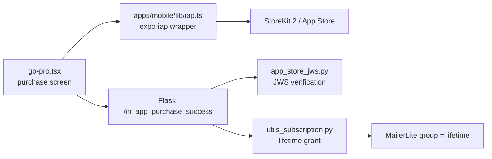
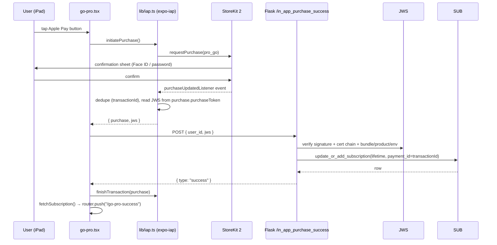

# Mobile In-App Purchase (IAP) Architecture

How the new mobile app (`apps/mobile`) sells Lifetime Pro through Apple In-App
Purchase, how the purchase is verified, and — more importantly — the failure
modes we hit during SPEC-054 Phase 3 and the guardrails that now prevent them.

## Related docs

- [SPEC-054 — Subscription & Payment Testing](../specs/054-subscription-payment-testing.md) — test matrix (A2/A3/A5, B83–B85)
- [ARCH-022 — Payment, Subscription & MailerLite](022-payment-subscription-mailerlite.md) — subscription model, purchase gating, state machine
- [SPEC-014 — Subscription & Payment System](../specs/014-subscription-payment-system.md) — product identifiers and canonical flow
- [SPEC-048 — Mobile Release Plan](../specs/048-mobile-release-plan.md) — bundle ID / store strategy

## Scope

This doc covers **iOS IAP only** (`pro_go`, non-consumable, lifetime). It is
the only in-app payment path on mobile: Stripe / PayPal / WeChat / Alipay are
website payments and were removed from the app (SPEC-054 Phase 3). Android
renders a "buy on our website" notice until Google Play Billing lands.

## Components

Only the UI (`go-pro.tsx`) and the wrapper (`lib/iap.ts`) live in the app.
Every store interaction goes through `expo-iap`; the backend never talks to
Apple directly on the purchase path (it verifies the signed transaction
locally).

## Purchase flow

Key detail: **the JWS is the proof**. StoreKit 2 hands every transaction to
the client as a signed JWS (`purchase.purchaseToken`). The backend verifies
it locally with `app_store_jws.py` — ES256/RS256 signature, `x5c` certificate
chain anchored to Apple Root CA G3, and payload checks for `bundleId`,
`productId`, `transactionId`, and `environment`. No shared secret, no call
back to Apple.

### Receipt vs. JWS — verdict

We evaluated both proofs during SPEC-054 Phase 3. The verdict:

**JWS is the primary proof; the legacy receipt is fallback-only.**

| | Legacy receipt | StoreKit 2 JWS |
|---|---|---|
| Source | `getReceiptDataIOS()` (base64 App Store receipt) | `purchase.purchaseToken` (signed transaction) |
| Verification | Call Apple's `verifyReceipt` with shared secret | Local signature + cert-chain verification |
| Network dependency | Requires Apple call + secret management | None after fetch |
| StoreKit 2 availability | Often empty; needs `AppStore.sync()` to refresh (password prompt loop — see Lesson 2) | Always present on the purchase object |

The backend endpoint (`/in_app_purchase_success`) accepts `jws` **first**;
the legacy `receipt` path remains only for StoreKit 1 clients that cannot
produce a JWS.

## Restore flow

`restorePurchases()` calls `getAvailablePurchases()` and returns matching
`pro_go` purchases (JWS included). The screen validates each against the same
endpoint, then `finishTransaction`s them. Restore intentionally does **not**
push `/go-pro-success` — it updates the go-pro screen in place (matches web).
The restore button is hidden for lifetime owners (nothing to restore).

## Identifiers

| | Classic | New mobile |
|---|---|---|
| Bundle ID | `ca.zerotohero.app` | `ca.zerotohero.go` (replaces GO listing) |
| Product | `pro` | `pro_go` (inherited from GO) |
| Grant | Lifetime | Lifetime |

The backend accepts both bundles so both apps keep working after launch
(SPEC-014, ADR-0013).

## Purchase gating (what the UI shows)

Per ARCH-022:

- **Active auto-renew** (non-trial + `payment_customer_id` + unexpired) →
  "cancel your existing subscription first" (inline notice, not a dialog).
- **Lifetime owner** → "already lifetime" box; no buy button, no restore
  button.
- **Everyone else** → Apple Pay button.

## Lessons learned the hard way (SPEC-054 Phase 3)

### 1. `expo-in-app-purchases` is dead on SDK 57

Expo SDK 57 removed the legacy ObjC bridge (`EXNativeModulesProxy`) that
`expo-in-app-purchases` (last published 2023) depends on. Tapping the button
failed with `Cannot find native module 'ExpoInAppPurchases'` even though the
native class was linked. Fix: migrate to **`expo-iap`** (OpenIAP-compatible,
maintained) and rebuild the development build.

### 2. `requestReceiptRefreshIOS()` = password prompt loop

Our original flow called `requestReceiptRefreshIOS()` to fetch the legacy App
Store receipt after purchase. That function runs **`AppStore.sync()`**, which
re-prompts for the Apple ID password — even after the purchase already
succeeded. In sandbox this loops forever (especially with an unverifiable
sandbox email).

**Rule: when a StoreKit 2 JWS is present, never call
`requestReceiptRefreshIOS()`.** The JWS is the backend's preferred proof; the
legacy receipt is only a fallback for StoreKit 1 paths with no JWS.

### 3. Sandbox accounts need a readable email

Apple sends sign-in verification codes to the sandbox account's address.
`iossandboxtester3@zerotohero.ca` had no readable inbox → endless
"verification code" loops. Use a plus-alias of a mailbox you can read
(`you+lpiap@gmail.com`). The email doesn't need to be a "real" Apple ID, but
it must be one you can receive mail at.

### 4. StoreKit replays → screen flashing / repeated pushes

StoreKit replays the same transaction event multiple times (restore,
relaunch with an unfinished transaction, and general replay). Without
dedupe, every replay:

- re-POSTed the same JWS to the backend (we saw **15+ identical grants** in
  one restore),
- re-pushed `/go-pro-success` once per replay (the "screen flashes ~10×"
  bug).

Guardrails in place:

- `_handledTransactions` (module scope in `iap.ts`) — listener-level dedupe
  by `transactionId`.
- `_restoreInProgress` — while `restorePurchases()` is running, the listener
  ignores events; the restore loop owns validation.
- `_processedTransactions` (module scope in `go-pro.tsx`) — effect-level
  dedupe so validate + navigate happen exactly once per transaction.

**Note:** these sets are module-scoped, so they reset on app relaunch. That's
intentional for correctness (the backend is idempotent via `payment_id` +
`ON CONFLICT`), but it means a relaunch may re-surface an unfinished
transaction once — which is the correct recovery behavior.

### 5. Success screen not appearing = stale session replay

After dedupe shipped, a purchase completed but `/go-pro-success` never
appeared. The cause: the app process had been alive since an earlier restore,
so `_handledTransactions` already contained the transaction ID and the
listener swallowed the new purchase event. A force-quit (fresh JS runtime)
fixed it. If this ever happens again: check whether the listener log line
`[IAP] purchase event received` appears — if not, the event was deduped.

### 6. `finishTransaction` after backend confirmation

Never finish a transaction before the backend confirms the grant —
`finishTransaction({ purchase, isConsumable: false })` runs only after
`{ type: "success" }`. Finishing early can lose the proof if the app crashes
mid-flight.

### 7. Lifetime owners vs. the "cancel first" gate

Lifetime rows have **no `payment_customer_id`**, so the auto-renew gate
(ARCH-022) never applies to them. They must get a distinct "already lifetime"
state — not "cancel first", not the buy button. Documented in ARCH-022's
state machine.

## Testing checklist (quick)

- Purchase (A2): confirm once → success screen once → exactly one backend
  grant.
- Restore (A3): exactly one grant, no replay burst, no repeated pushes.
- Repeat purchase (A5): lifetime owner sees "already lifetime"; backend
  rejects/absorbs a replayed transaction without a duplicate row.
- Sandbox email must be readable (Lesson 3).

## Cross-references

- Backend JWS verification: `zerotohero-python-server/app_store_jws.py`
- Purchase screen: `apps/mobile/app/(tabs)/(me)/go-pro.tsx`
- IAP wrapper: `apps/mobile/lib/iap.ts`
- Success screen: `apps/mobile/app/go-pro-success.tsx`
- Gating rule + state machine: ARCH-022
